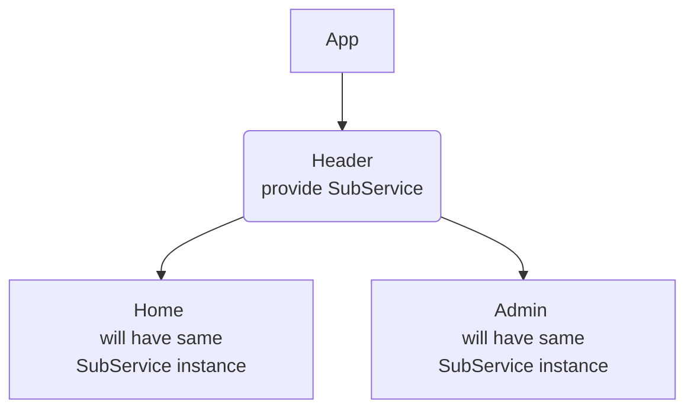
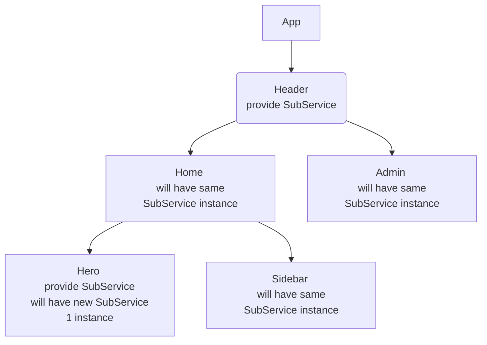
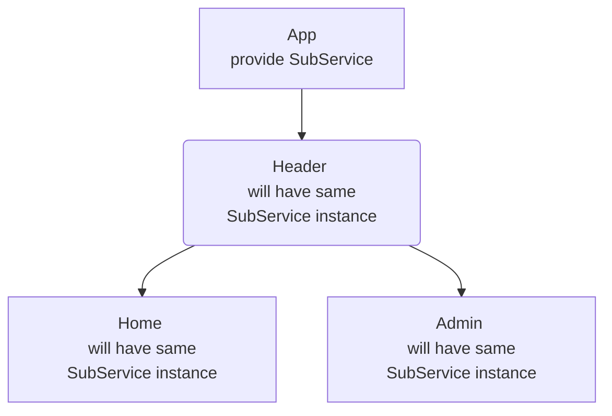
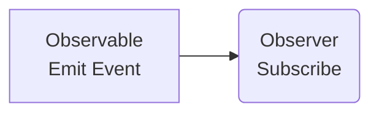

## Angular CLI

```bash 
// Generate component
ng g c product-list 

// Generate directive
ng g d set-background
```

## Types of Component Selectors

* Used as html tag: `<app-nav></app-nav>` 
* Used as html attribute: `<div app-nav></div>`
* Used as css class: `<div class="app-nav"></div>` 

Summary: Mainly used html tag, but will use attribute in case of angular directives

## Data Binding

Data Binding in Angular allows us to communicate between a **component class** and its corresponding **view template** & vice-versa. 


## Component Communication

#### Related Component
* Parent to Child, use *@Input* Decorater 

`parent.component.html`
```html
<app-child [product]="product"></app-child>
```

`child.component.ts`
```typescript
@Input()
product: Product;
```

* Child to Parent, use *@Output* Decorater 

`child.component.ts`
```typescript
@Output()
backToListEvent: EventEmitter<string> = new EventEmitter<string>();

backToList() {
  this.backToListEvent.emit('back');
}
```

`parent.component.html`
```html
<app-child (backToListEvent)="backToListEvent()"></app-child>
```

`parent.component.ts`
```typescript
backToListEvent() {
  this.showCreateProductForm = false;
}
```

#### Non-Related Component


## Template Reference Variable
A template reference variable is a variable which store a reference to a DOM element, Component or Directive on which it is used.
* On DOM element

```html
<input class="product-input" #searchInput>
<button (click)="clickSearch()">Search</button>
```

```typescript
@ViewChild('searchInput')
searchInput: ElementRef;
clickSearch() {
  this.searchText = this.searchInput.nativeElement.value;
}
```

* On Custom Component

```html
<product-list #productListComponent></product-list>
<product-detail *ngIf="productListComponent.selectedProduct"></product-detail>
```

#### ng-template

The ng-template is an Angular element which wraps an html snippet. This html snippet acts and can be used like a template and can be rendered in the DOM.

```html
<ng-template #myTemplate>
  <h3>This is a template</h3>
</ng-template>

<div *ngTemplateOutlet="myTemplate"></div>
<ng-container *ngTemplateOutlet="myTemplate"></ng-container>
```

#### ng-container

The ng-container is a special Angular element that can hold structural directives without adding new elements to the DOM.
*Note: if use div in ngFor, then it will add extra div in DOM*

```html
<ng-container *ngFor="let item of products">
  <p>{{ item.name }}</p>
  <p>{{ item.price }}</p>
</ng-container>
```  

## Content Projection
Used in Parent - Child component 

#### ng-content

`parent.component.html`
```html
<h2>Parent Component</h2>
<app-child>
  <h3>content to child</h3>
</app-child>
```

`child.component.html`
```html
<h2>Child Component</h2>
<ng-content></ng-content>
```

#### @ContentChild()

`parent.component.html`
```html
<h2>Parent Component</h2>
<app-child>
  <h3>content to child</h3>
  <p #paragraph>This is a paragraph</p>
</app-child>
```

`child.component.ts`
```typescript
export class ChildComponent {
  @ContentChild('paragraph') 
  paraEl: ElementRef;
}
```

## Lifecycle hook

#### Component Initialization (Constructor)


#### ngOnChanges


#### ngOnInit


#### ngDoCheck


#### ngAfterContentInit


#### ngAfterContentChecked


#### ngAfterViewInit


#### ngAfterViewChecked


#### ngOnDestroy


## Custom Attribute Directive

```typescript
import { Directive, ElementRef, OnInit, Renderer2 } from '@angular/core';

@Directive({
  selector: '[appSetBackground]'
})
export class SetBackgroundDirective implements OnInit {
  // private element: ElementRef;

  constructor(private element: ElementRef, private renderer: Renderer2) {
    // this.element = element;
  }

  ngOnInit() {
    this.element.nativeElement.style.backgroundColor = '#36454F';
    this.element.nativeElement.style.color = 'white';
  }
}

```

#### Renderer2

In Angular, we don't recommand to update DOM element via nativeElement, the reason is:
1. Angular keeps the component & view in sync using templates, data binding and change detection etc. All of them are bypassed when we update the DOM directly.
2. The DOM manipulation works only in browsers. You will not be able to use your app in other platforms like web workers, server-side rendering, desktop or mobile apps etc, where there is no browser.
3. The DOM API's does not sanitize the data, Hence it is possible to inject a script, thereby, opening our app an easy target for the XSS injection attacks.

Renderer2 allows us to manipulate the DOM without accessing the DOM elements directly, by providing a layer of abstraction between the DOM element and the component code.

```typescript
import { Directive, ElementRef, OnInit, Renderer2 } from '@angular/core';

@Directive({
  selector: '[appSetBackground]'
})
export class SetBackgroundDirective implements OnInit {

  constructor(private element: ElementRef, private renderer: Renderer2) {}

  ngOnInit() {
    // this.element.nativeElement.style.backgroundColor = '#36454F';
    // this.element.nativeElement.style.color = 'white';
    this.renderer.setStyle(this.element.nativeElement, 'backgroundColor', '#36454F');
    this.renderer.setStyle(this.element.nativeElement, 'color', '#white');
    this.renderer.setAttribute(this.element.nativeElement, 'title', 'html attribute title');
    this.renderer.addClass(this.element.nativeElement, 'css-class-name');
  }
}

```

#### @HostListener

The @HostListener decorator listens to a DOM event on the host element and it reacts to that event by executing an event handler method.
  
```typescript
  import { Directive, ElementRef, HostListener, Renderer2 } from '@angular/core';

  @Directive({
    selector: '[appHighlight]'
  })
  export class HighlightDirective {

    constructor(private element: ElementRef, private renderer: Renderer2) { }

    @HostListener('mouseenter') 
    onMouseEnter() {
      this.renderer.addClass(this.element.nativeElement, 'highlight-price');
    }

    @HostListener('mouseout') 
    onMouseOut() {
      this.renderer.removeClass(this.element.nativeElement, 'highlight-price');
    }
  }

```

#### @HostBinding

The @HostBinding decorator binds a host elements property to a property of a directive or a component class.

```typescript
import { Directive, ElementRef, HostBinding, HostListener, Renderer2 } from '@angular/core';

@Directive({
  selector: '[appHover]'
})
export class AppHoverDirective {

  constructor(private element: ElementRef, private renderer: Renderer2) { }

  @HostBinding('style.backgroundColor') backgroundColor: string = '#28282B';
  @HostBinding('style.border') border: string = 'none';

  @HostListener('mouseenter')
  onMouseEnter() {
    this.backgroundColor = 'white';
    this.border = '1px solid red';
  }

  @HostListener('mouseout')
  onMouseOut() {
    this.backgroundColor = '#28282B';
    this.border = 'none';
  }
}
```

#### Property binding in Directive

Requirement: the background color and text color should be set by user
```typescript
import { Directive, ElementRef, OnInit, Renderer2, Input } from '@angular/core';

@Directive({
  selector: '[appSetBackground]'
})
export class SetBackgroundDirective implements OnInit {
  @Input() backgroundColor: string = '#36454F';
  @Input() textColor: string = 'white'

  // wrap above 2 properties to 1, appSetBackground is alias for this property
  @Input('appSetBackground') changeTextAndBackgroundColor: {backgroundColor: string, textColor: string}

  constructor(private element: ElementRef, private renderer: Renderer2) { }

  ngOnInit() {
    this.renderer.setStyle(this.element.nativeElement, 'backgroundColor', this.backgroundColor);
    this.renderer.setStyle(this.element.nativeElement, 'color', this.textColor);

    this.renderer.setStyle(this.element.nativeElement, 'backgroundColor', this.changeTextAndBackgroundColor.backgroundColor);
    this.renderer.setStyle(this.element.nativeElement, 'color', this.changeTextAndBackgroundColor.textColor);
  }
}

```

```html
<span appSetBackground [backgroundColor]="'red'" [textColor]="'yellow'"></span>

<span [appSetBackground]="{backgroundColor: 'red', textColor: 'yellow'}"></span>
```

#### Conditional Attribute Directive

Requirement: for out of stock product, the directive should add extra css class to host element. For normal product, the directive will do nothing.
```typescript
import { Directive, ElementRef, Renderer2, Input } from '@angular/core';

@Directive({
  selector: '[disableProduct]'
})
export class DisableProductDirective {
  constructor(private element: ElementRef, private renderer: Renderer2) { }

  // use typescript setter on property, we can implement that property like a method
  @Input() 
  set disableProduct(disabled: boolean) {
    if (disabled) {
      this.renderer.addClass(this.element.nativeElement, 'disable-out-of-stock-product');
    }
  }
}
```

```html
<span [disableProduct]="!product.is_in_inventory"></span>
```

#### Create Custom ngClass Directive

ngClass useage like below:
```html
<span [ngClass]="{appHighlight: true, 'app-container': false}"></span>
```

Create own ngClass:
```typescript
import { Directive, ElementRef, Renderer2, Input } from '@angular/core';

@Directive({
  selector: '[appClass]'
})
export class ClassDirective {
  constructor(private element: ElementRef, private renderer: Renderer2) { }

  // set alias to directly use appClass in html
  @Input('appClass') set display(value: Object) {
    let entries = Object.entries(value);
    for (let item of entries) {
      let[className, condition] = item;
      if (condition) {
        this.renderer.addClass(this.element.nativeElement, className);
      }
    }
  }
}
```

```html
<span [appClass]="{appHighlight: true, 'app-container': false}"></span>
```

#### Create Custom ngStyle Directive

ngStyle useage like below:

```html
<span [ngStyle]="{backgroundColor: active ? 'green' : 'red'}"></span>
```

Create own ngStyle:
```typescript
import { Directive, ElementRef, Renderer2, Input } from '@angular/core';

@Directive({
  selector: '[appStyle]'
})
export class StyleDirective {
  constructor(private element: ElementRef, private renderer: Renderer2) { }

  // set alias to directly use appStyle in html
  @Input('appStyle') set style(styles: Object) {
    let entries = Object.entries(styles);
    for (let item of entries) {
      let[styleName, styleValue] = item;
      this.renderer.setStyle(this.element.nativeElement, styleName, styleValue);
    }
  }
}
```

```html
<span [appStyle]="{backgroundColor: active ? 'green' : 'red'}"></span>
```

#### How a Structural Directive Works

*ngIf useage like below:
```html
<div *ngIf="display; else myTemplate">
  <p>this is a p element</p>
</div>

<ng-template #myTemplate>
  <p>it is else block</p>
</ng-template>
```
Structural directive start with *, so when angular parsing this div element, if contain *, then it will convert to below:
```html
<ng-template [ngIf]="display" [ngIfElse]="myTemplate">
  <div>
    <p>this is a p element</p>
  </div>
</ng-template>

<ng-template #myTemplate>
  <p>it is else block</p>
</ng-template>
```

#### Create Custom ngIf Structural Directive
```typescript
import { Directive, TemplateRef, ViewContainerRef, Input } from '@angular/core';

@Directive({
  selector: '[appIf]'
})
export class IfDirective {
  // 1. Get access to the DOM element which we want to Add / Remove
  // 2. Place from where we want to Add or remove DOM element
  constructor(private view: TemplateRef<any>, private template: ViewContainerRef) { }

  @Input() set appIf(condition: boolean) {
    if (condition) {
      this.template.createEmbeddedView(this.view);
    } else {
      this.template.clear();
    }
  }
}
```

```html
<div *appIf="true">
  <p>this is a p element</p>
</div>
```

#### Structural Directive - ngSwitch
```html
<div [ngSwitch]="tab">
  <p *ngSwitchDefault>tab 1</p>
  <p *ngSwitchCase="'tab2'">tab 2</p>
  <p *ngSwitchCase="'tab3'">tab 3</p>
</div>
```

## Services
A service in Angular is a re-usable typescript class that can be used in multiple components across our Angular application.
Using services, we can communicate between non-related components in an easier way.

#### Dependency Injection (DI)

DI is a technique (design pattern) using which a class receives its dependencies from an external source rather than creating them itself.

*Disadvantage of not using Dependency Injection*
1. Without DI, a class is tightly coupled with its dependency. This makes a class non-flexible. Any change in dependency forces us to change the class implementation.
2. It makes testing of class difficult. Because if the dependency changes, the class has to change. And when the class changes, the unit test mock code also has to change.

*Advantage of not using Dependency Injection*
1. DI keeps the code flexible, testable, and mutable.
2. Classed can inherit external logic without knowing how to create it.
3. DI benefits component, directives and pipes.

#### Hierarchical Dependency Injection

When we provide a depdendency on a component, the same instance of that dependency is injected in component class and all its child components and their child components.



* Dependency Override

When we provide a dependency on a component and we also provide a dependency on its child component, child component dependency instance will override its parent component dependency instance.



* Dependency injection on Root Component

When we provide a dependency on root component, same instance of that dependency is injected to all components, directives and services.



```typescript
import SubService from './services/sub.service'
@Component({
  selector: 'app-root',
  templateUrl: './app.component.html',
  providers: [SubService]
})
export class AppComponent {
  constructor(private subService: SubService) {}

  subscribe = this.subService.subscribe();
}
```

* Module Injector

We can also inject a service from Module class. In that case same instance of the dependency will be available throughout the Angular application. In this way we implement singleton pattern where a single instance is shared throughout the application.

```typescript
import SubService from './services/sub.service'
@NgModule({
  declarations: [AppComponent, HeaderComponent],
  imports: [BrowserModule],
  providers: [SubService]
})
export class AppModule {}
```

#### Injecting Service into Another Service
```typescript
import {Injectable} from '@angular/core';
import {LoggerService} from "./logger.service";

@Injectable()
export class UserService {
  constructor(private logger: LoggerService) {}

  createUser() {
    this.logger.logMessage();
  }
}
```

```typescript
import {Injectable} from '@angular/core';

@Injectable() // Optional to add, except depends on other service
export class LoggerService {
  logMessage() {}
}
```

```typescript
import {LoggerService} from './services/logger.service'
import {UserService} from './services/user.service'

@NgModule({
  declarations: [AppComponent, HeaderComponent],
  imports: [BrowserModule],
  providers: [UserService, LoggerService]
})
export class AppModule {}
```

#### Injection Token

`providers: [UserService]` is syntactic sugar for `providers: [{provide: UserService, useClass: UserService}]`

But sometimes, the dependency need to inject is not a instance of class, it maybe a configuration value or string, so we need injection token.

`config.tokens.ts`
```typescript
import { InjectionToken } from '@angular/core';
export const LANG_CONFIG = new InjectionToken<string>('langConfig');
```

`app.module.ts`
```typescript
import { NgModule } from '@angular/core';
import { LANG_CONFIG } from './config.tokens';

@NgModule({
  providers: [
    {
      provide: LANG_CONFIG,
      useValue: 'en-US'
    }
  ]
})
export class AppModule { }
```

`app.module.ts`
```typescript
import { Component, Inject } from '@angular/core';
import { LANG_CONFIG } from './config.tokens';

@Component({
  selector: 'app-root',
  templateUrl: './app.component.html',
})
export class AppComponent {
  constructor(@Inject(LANG_CONFIG) private langConfig: string) {}
}
```

#### Non-Related Component Interaction using Services

`user.service.ts`
```typescript
export class UserService {
  OnUserDetailsClicked: EventEmitter<User> = new EventEmitter<User>();

  OnShowUserDetails(user: User) {
    this.OnUserDetailsClicked.emit(user);
  }
}
```

`user-list.component.ts`
```typescript
export class UserListComponent {
  userService = inject(UserService);

  ShowUserDetails(user: User) {
    this.userService.OnShowUserDetails(user);
  }
}
```

`user-detail.component.ts`
```typescript
export class UserDetailComponent {
  selectedUser: user;
  userService = inject(UserService);

  ngOnInit() {
    this.userService.OnUserDetailsClicked.subscribe((data: User) => {
      this.selectedUser = data;
    })
  }
}
```

## Observable

An Observable is a wrapper around asynchronous data. We use an observable to handle asynchronous data.

RxJS Main Players:


#### Promise vs Observable

| Promise | Observable |
|---------|------------|
| Promise is eager. It returns the data as soon <br>as a promise is created | Observable is lazy. It only emits the data if <br>there is a subscriber for that observable |
| Promise can emit only a single value | Observable can emit single or multiple values. |

```typescript
export class AppComponent {
  ngOnInit() {
    const promise = new Promise((resolve, reject) => {
      console.log("Promise is called");
      resolve(100);
    })

    const obs = new Observable((sub) => {
      console.log("Observable is called");
      sub.next(100);
    })
  }
}
```

```console
Promise is called
```

#### Next, Error and Completion of Observable
```typescript
export class AppComponent {
  myObservable = new Observable((observer) => {
    setTimeout(() => {observer.next(1)}, 1000);
    setTimeout(() => {observer.next(2)}, 2000);
    setTimeout(() => {observer.next(3)}, 3000);
    setTimeout(() => {observer.error(new Error('Something went wrong. Please try again later!'))}, 3000);
    setTimeout(() => {observer.complete()}, 3000);
    // after error or complete event called, the following logic will not execute.
    setTimeout(() => {observer.next(4)}, 4000); 
    setTimeout(() => {observer.next(5)}, 5000);
  });

  getAsyncData() {
    this.myObservable.subscribe({
      next: (value) => {
        console.log(value);
      },
      error: (err) => {
        console.log(err.message);
      },
      complete: () => {
        console.log('all the data is streamed!')
      }
    })
  }
}
```

```console
Output: 1, 2, 3, 'Something went wrong. Please try again later!'
```

#### RxJS of() & from() Operator
* The of Operator

The of operator creates an observable from the arguments that we pass into it. You can pass any number of arguments to of operator.
Each argument is emitted separately one after the other. It send the complete signal at the end.

```typescript
export class AppComponent {
  array1 = [1, 3, 5, 7];
  array2 = ['A', 'B', 'C', 'D'];

  myObservable = of(this.array1, this.array2, 'Hello', true);

  getAsyncData() {
    this.myObservable.subscribe({
      next: (value) => {
        console.log(value);
      },
      error: (err) => {
        console.log(err.message);
      },
      complete: () => {
        console.log('all the data is streamed!');
      }
    })
  }
}
```

```console
Output: [1, 3, 5, 7], ['A', 'B', 'C', 'D'], 'Hello', true, 'all the data is streamed!'
```

* The from Operator

The from operator takes a single argument which can be iterated over and convers it into an observable.

```typescript
export class AppComponent {
  array1 = [1, 3, 5, 7];

  myObservable = from(this.array1); // array or string which can be iterated

  getAsyncData() {
    this.myObservable.subscribe({
      next: (value) => {
        console.log(value);
      },
      error: (err) => {
        console.log(err.message);
      },
      complete: () => {
        console.log('all the data is streamed!');
      }
    })
  }
}
```

```console
Output: 1, 3, 5, 7, 'all the data is streamed!'
```

The from operator also can be used to convert a Promise to Observable, like blow:

```typescript
export class AppComponent {
  promiseData = new Promise((resolve, reject) => {
    resolve([10, 20, 30]);
  })

  myObservable = from(this.promiseData);

  getAsyncData() {
    this.myObservable.subscribe({
      next: (value) => {
        console.log(value);
      },
      error: (err) => {
        console.log(err.message);
      },
      complete: () => {
        console.log('all the data is streamed!');
      }
    })
  }
}
```

```console
Output: [10, 20, 30], 'all the data is streamed!'
```

#### The fromEvent Operator
Angular provides FromEvent method to create an observable from DOM events directly.

```html
<button #btn>Button</button>
```

```typescript
export class AppComponent {
  @ViewChild('btn') button: ElementRef;

  ngAfterViewInit() {
    fromEvent(this.button.nativeElement, 'click').subscribe((data) => {
      console.log(data);
    })
  }
}
```

#### RxJS map & filter Operator
The map operator is used to transform data emitted by a source observable in some way.

The filter operator is used to filter data emitted by a source observable based on a given condition.

```typescript
import { from } from 'rxjs';
import { filter, map } from 'rxjs/operators';

export class AppComponent {
  myObservable = from([2, 4, 6, 8, 10, 12]).pipe(
    map((val) => {
      return val * 5; // Result: 10, 20, 30, 40, 50, 60
    }),
    filter((val, i) => {
      return val % 4 === 0; // Result: 20, 40, 60
    })
  )

  getAsyncData() {
    this.myObservable.subscribe({
      next: (value) => {
        console.log(value);
      },
      error: (err) => {
        console.log(err.message);
      },
      complete: () => {
        console.log('all the data is streamed!');
      }
    })
  }
}
```

```console
Output: 20, 40, 60, 'all the data is streamed!'
```

#### Subject in RxJS
A subject is a special type of observable that allows values to be muticasted to many observers. Subject are like EventEmitters, see the section on [`Non-Related Component Interaction using Services`](#non-related-component-interaction-using-services).

`task.service.ts`
```typescript
import { Injectable } from '@angular/core';
import { Subject } from 'rxjs';

@Injectable({
  providedIn: 'root'
})
export class TaskService {
  createTask = new Subject<string>();

  onCreateTask(value: string) {
    this.createTask.next(value);
  }
}
```

`new-task.component.ts`
```typescript
export class NewTaskComponent {
  taskService: TaskService = inject(TaskService);

  createTaskButton(value: string) {
    this.taskService.onCreateTask(value);
  }
}
```

`show-task.component.ts`
```typescript
export class ShowTaskComponent implements OnInit{
  taskService: TaskService = inject(TaskService);

  ngOnInit() {
    this.taskService.createTask.subscribe((newTask: string) => {
      console.log(newTask);
    })
  }
}
```

#### Observable vs Subject
A subject is multicase, observable is unicast.

Observable is unicast, so below 2 subscribe get different random data. If it is a API call in the observable, then 2 subscribe will cause 2 times API calls.
```typescript
export class AppComponent  {
  ngOnInit() {
    let obs = new Observable((observer) => {observer.next(Math.random())})

    obs.subscribe((data) => {console.log(data)}); // 0.3829565975676479
    obs.subscribe((data) => {console.log(data)}); // 0.3242813513801659
  }
}
```

Subject is multicase, so below 2 subscribe get same random data. If it is a API call in the subject, then API call will only have once even there are 2 subscribe.
```typescript
export class AppComponent  {
  ngOnInit() {
    let subject = new Subject();

    subject.subscribe((data) => {console.log(data)}); // 0.4420342518764011
    subject.subscribe((data) => {console.log(data)}); // 0.4420342518764011

    subject.next(Math.random()); // Should subscribe first, then emit value
  }
}
```

#### Behavior Subject
A BehaviourSubject is a subject which can hold an initial value which it emits if no new value is emitted. A BehaviourSubject emits an initial value or last emitted value for a new subscriber.

```typescript
export class AppComponent {
  ngOnInit() {
    let subject = new BehaviorSubject<number>(100);

    subject.subscribe((data) => {console.log("subscriber 1:", data)});
    subject.subscribe((data) => {console.log("subscriber 2:", data)});

    subject.next(200);

    subject.subscribe((data) => {console.log("subscriber 3:", data)});
  }
}
```

```console
subscriber 1: 100
subscriber 2: 100
subscriber 1: 200
subscriber 2: 200
subscriber 3: 200
```

#### Replay Subject
ReplaySubject replays old values to new subscribers when they first subscribe.

The ReplaySubject will store every value it emits in a buffer. It will emit them to the new subsribers in the order it received them. You can configure the buffer using the arguments *bufferSize* and *windowTime*

* bufferSize: Number of items that ReplaySubject will keep in its buffer. It defaults to infinity.
* windowTime: The amount of time to keep the value in the buffer. Defaults to infinity.

```typescript
export class AppComponent {
  ngOnInit() {
    let subject = new ReplaySubject();

    subject.next(100);

    subject.subscribe((data) => {console.log("subscriber 1:", data)});

    subject.next(200);

    subject.subscribe((data) => {console.log("subscriber 2:", data)});
  }
}
```

```console
subscriber 1: 100
subscriber 1: 200
subscriber 2: 100
subscriber 2: 200
```

#### Async Subject
AsyncSubject only passed the last emitted value to all its subscribers once the complete method is called on it.

```typescript
export class AppComponent {
  ngOnInit() {
    let subject = new AsyncSubject();

    subject.next(100);
    subject.next(200);

    subject.subscribe((data) => {console.log("subscriber 1:", data)});

    subject.complete(); // if this complete method not called, then no value emitted.

    subject.subscribe((data) => {console.log("subscriber 2:", data)});
  }
}
```

```console
subscriber 1: 200
subscriber 2: 200
```

#### Unsubscribe from an Observable

Below code will output sequence number every second after user click subscribe button, and it will generate number infinitely if unsubscribe button not clicked.
```typescript
import { Component } from '@angular/core';
import { interval, Subscription } from 'rxjs';

@Component({
  selector: 'app-root',
  templateUrl: './app.component.html',
  styleUrls: ['./app.component.css']
})
export class AppComponent {
  counter = interval(1000);
  subscriber: Subscription;

  OnSubscribe() {
    this.subscriber = this.counter.subscribe((val) => {
      console.log(val);
    })
  }

  OnUnsubscribe() {
    this.subscriber.unsubscribe();
  }
}

```

```console
0
1
2
3
...
```

## Angular Router & Route Guards

#### Routes basic example
```typescript
// routing.module.ts
import { RouterModule, Routes } from '@angular/router';

const routes: Routes = [
  {path: '', component: HomeComponent},
  {path: 'Home', component: HomeComponent},
  {path: 'About', component: AboutComponent},
  {path: 'Courses', component: CoursesComponent},
  {path: '**', component: NotFoundComponent}
]

@NgModule({
  imports: [
    RouterModule.forRoot(routes)
  ],
  exports: [
    RouterModule
  ]
})

export class RoutingModule { }
```

```typescript
// app.module.ts
@NgModule({
  imports: [
    BrowserModule,
    RoutingModule
  ],
})
export class AppModule { }
```

```html
<!-- app.component.html -->
<app-header></app-header>
<route-outlet></route-outlet>
<app-footer></app-footer>
```

```html
<!-- Header.html -->
<a routerLink="Home" routerLinkActive="active">Home</a>
<a [routerLink]="'About'" routerLinkActive="active">About</a>
<button (click)="navigateToCourses()">Courses</button>
```

```typescript
import { Component, inject } from '@angular/core';
import { ActivatedRoute, Router } from '@angular/router';

export class HeaderComponent {
  router: Router = inject(Router);
  activeRoute: ActivatedRoute = inject(ActivatedRoute)

  navigateToCourses() {
    // Default to use absolute path, localhost:4200/Courses
    this.router.navigate(['Courses']);

    // Change to relative path, append to current active route:
    // localhost:4200/Home/Courses
    this.router.navigate(['Courses'], {relativeTo: this.activeRoute})
  }
}
```

#### Route parameters
Route parameters are required and it is used by Angular router to detemine the route. Route Parameters are part of route definition.

e.g. localhost:4200/Courses/Course/101

```typescript
// AppModule
const routes: Routes = [
  {path: 'Courses', component: CoursesComponent, children: [
    {path: 'Course/:id', component: CourseDetailComponent}
  ]}
]
```

```typescript
import { Component, inject } from '@angular/core';
import { ActivatedRoute, Router } from '@angular/router';

export class CourseDetailComponent implements OnInit, OnDestroy{
  selectedCourse: Course;
  paramMapObs;
  
  courseService: CourseService = inject(CourseService);
  activeRoute: ActivatedRoute = inject(ActivatedRoute);

  ngOnInit() {
    // this snapshot only can get correct id when initilized, when id changed, the component will not know. So we need to use paramMap Observable 
    const courseId = this.activeRoute.snapshot.paramMap.get('id');
    this.selectedCourse = courseService.get(courseId);

    // paramMap Observable
    this.paramMapObs = this.activeRoute.paramMap.subscribe((data) => {
      const courseId = data.get('id');
      this.selectedCourse = courseService.get(courseId);
    })
  }

  ngOnDestroy() {
    this.paramMapObs.unsubscribe();
  }
}
```

#### Query String in Route
Query strings are optional data which we pass through route. If the query parameter is missing in the URL, then it will NOT stop angular from navigating to the route.

e.g. localhost:4200/Courses?search=javascript

```html
<!-- Home.html -->
<button (click)="searchCourses('javascript')"></button>
```

```typescript
// HomeComponent
searchCourses(name: string) {
  this.router.navigate(['Courses'], {queryParams: {search: name}});
}
```

```typescript
// CoursesComponent
ngOnInit() {
  this.activeRoute.queryParamMap.subscribe((data) => {
    const searchString = data.get('search');
  })
}
```

#### Fragment in Route
A fragment in a route is a link which jumps to a section or a content in the HTML page, which contains the ID mentioned in the fragment. A fragment comes after a # sign.

e.g. localhost:4200/Home#services

```html
<!-- header.html -->
<a routerLink="Home" fragment="search">Search</a>
<a routerLink="Home" fragment="courses">Courses</a>
<a routerLink="Home" fragment="services">Services</a>
```

```html
<!-- home.component.html -->
<section id="search">
  <app-banner></app-banner>
</section>
<section id="courses">
  <app-courses></app-courses>
</section>
<section id="services">
  <app-services></app-services>
</section>
```

```typescript
// HomeComponent
ngOnInit(){
  this.activeRoute.fragment.subscribe((data) => {
    this.JumpToSection(data);
  })
}

JumpToSection(section) {
  document.getElementById(section).scrollIntoView({behavior: 'smooth'});
}
```

#### Route Guards

* CanActivate

*Angular 14 & Lower versions:*
```typescript
// auth-guard.service.ts
@Injectable({
  providedIn: 'root'
})
export class AuthGuardService implements CanActivate{
  authService: AuthService = inject(AuthService);
  router: Router = inject(Router);

  canActivate(route: ActivatedRouteSnapshot, state: RouterStateSnapshot): boolean{
    if (this.authService.isAuthenticated()) {
      return true;
    } else {
      this.router.navigate(['/Login']);
      return false;
    }
  }
}
```

```typescript
// routing.module.ts
const routes: Routes = [
  {path: 'Checkout', component: CheckoutComponent, canActivate: [AuthGuardService]}
]
```

*Angular 15 & Higher versions, change to functional programming*
```typescript
// auth.guard.ts
export const CanActivate = () => {
  const authService = inject(AuthService);
  const router = inject(Router);

  if (authService.isAuthenticated()) {
    return true;
  } else {
    router.navigate(['/Login']);
    return false;
  }
}
```

```typescript
// routing.module.ts
import { CanActivate } from './auth.guard.ts'
const routes: Routes = [
  {path: 'Checkout', component: CheckoutComponent, canActivate: [CanActivate]}
]
```

* CanActivateChild

```typescript
// routing.module.ts
import { CanActivate, CanActivateChild } from './auth.guard.ts'
const routes: Routes = [
  {path: 'Courses', component: CoursesComponent, canActivateChild: [CanActivateChild], children: [
    {path: 'Course/:id', component: CourseComponent},
    {path: 'Checkout', component: CheckoutComponent}
  ]}
]
```

* CanDeactivate

```typescript
// auth.guard.ts
export const CanDeactivate = (comp: Component) => {
  return comp.canExit();
}
```

```typescript
// routing.module.ts
import { CanDeactivate } from './auth.guard.ts'
const routes: Routes = [
  {path: 'Contact', component: ContactComponent, canDeactivate: [CanDeactivate(ContactComponent)]}
]
```

```typescript
// ContactComponent
canExit() {
  if((this.firstName || this.lastName || this.message) && !this.isSubmitted) {
    return confirm('You have unsaved changes. Do you want to navigate away?');
  } else {
    return true;
  }
}
```

* Resolve

```typescript
// auth.guard.ts
export const Resolve = () => {
  const courseService = inject(CourseService);
  return courseService.getAllCourses();
}
```

```typescript
// routing.module.ts
import { Resolve } from './auth.guard.ts'
const routes: Routes = [
  {path: 'Contact', component: ContactComponent, resolve: (courses: Resolve)}
]
```

#### Router Navigation Events

```typescript
// AppComponent.ts
export class AppComponent implements OnInit {
  showLoader: boolean = false;
  router: Router = inject(Router);

  ngOnInit() {
    this.router.events.subscribe((routerEvent: Event) => {
      if (routerEvent instanceof NavigationStart) {
        this.showLoader = true;
      }

      if (routerEvent instanceof NavigationEnd || routerEvent instanceof NavigationCancel || routerEvent instanceof NavigationError) {
        this.showLoader = false;
      }
    })
  }
}
```

#### Passing Data with a Route

* Static data

```typescript
// routing.module.ts
const routes: Routes = [
  {path: 'Checkout', component: CheckoutComponent, data: {name: 'test', price: 399}}
]
```

```typescript
// CheckoutComponent.ts
export class CheckoutComponent implements OnInit {
  activeRoute: ActivatedRoute = inject(ActivatedRoute);
  course;

  ngOnInit(): void {
    this.activeRoute.data.subscribe((data) => {
      this.course = data;
    })
  }
}
```

* Dynamic data

```html
<button routerLink="/Courses/Checkout" [state]="course">BUY NOW</button>
```

```typescript
// CheckoutComponent.ts
export class CheckoutComponent implements OnInit {
  router: Router = inject(Router);
  course;

  ngOnInit(): void {
    this.course = this.router.getCurrentNavigation().extras.state;
  }
}
```

## Pipes in Angular
```html
<p>{{student.dob | date: 'longDate' | uppercase}}</p>
```

#### Create Custom Pipes
```typescript
// percentage.pipe.ts
import { Pipe, PipeTransform } from "@angular/core";

@Pipe({
  name: 'percentage'
})
export class PercentagePipe implements PipeTransform{
  transform(value: number, total: number, decimal: number = 0) {
    return (value / total * 100).toFixed(decimal) + ' %';
  }
}
```

```html
<p>{{1 | percentage: 200: 2}}</p>
```

* Pure pipe - default pipe is pure pipe

A pure pipe is only called when Angular detects a change in the value or the parameters passed to a pipe.
```typescript
@Pipe({
  name: 'filterPipe', 
  pure: true     
})
export class FilterPipe {}
```

* Impure pipe

An impure pipe is called for every change detection cycle no matter whether the value or parameter(s) changes. 

*So impure pipe executes everytime irrespective of source has changed or not. which leads to bad performance. thats why it is not recommneded to use pipes for filtering data.*

```typescript
@Pipe({
  name: 'filterPipe', 
  pure: false
})
export class FilterPipe
```

#### Async Pipe in Angular
```html
<div>Total student: {{totalStudents | async}}</div>
```

```typescript
totalStudents = new Promise((resolve, reject) => {
  setTimeout(() => {
    resolve(6);
  }, 3000)
})
```

## Angular HTTP Client

#### Handling HTTP Error using Subject
```typescript
// task.service.ts
export class TaskService {
  http: HttpClient = inject(HttpClient);
  errorSubject = new Subject<HttpErrorResponse>();

  createTask() {
    const url = 'https://test.com/task';
    this.http.post(url, {name: 'new task'}).subscribe({error: (error) => {
      this.errorSubject.next(error);
    }})
  }
}
```

```typescript
// task.component.ts
export class TaskComponent {
  errorSub: Subscription;
  taskService: TaskService = inject(TaskService);

  ngOnInit() {
    this.errorSub = this.taskService.errorSubject.subscribe({next: (httpError) => {
      console.log(httpError);
    }})
  }

  ngOnDestroy() {
    this.errorSub.unsubscribe();
  }

  createTask() {
    this.taskService.createTask();
  }
}
```

#### Logging Errors with catchError
```typescript
createTask() {
  const url = 'https://test.com/task';
  this.http.post(url, {name: 'new task'})
    .pipe(catchError(err => {
      // Logging Errors, then throw to subscribe error callback function
      return throwError(() => err);
    }))
    .subscribe({error: (error) => {
      this.errorSubject.next(error);
    }})
}
```

#### Interceptors in Angular

```typescript
// app.module.ts
@NgModule({
  providers: [
    {provide: HTTP_INTERCEPTORS, useClass: AuthInterceptorService, multi: true},
    {provide: HTTP_INTERCEPTORS, useClass: LoggingInterceptorService, multi: true}
  ],
})
export class AppModule { }
```

```typescript
// auth-interceptor.service.ts
// interceptor service only can be injected via module providers
export class AuthInterceptorService implements HttpInterceptor{
  intercept(req: HttpRequest<any>, next: HttpHandler) {
    const modifiedReq = req.clone({headers: req.headers.append('auth', 'abc')});
    return next.handle(modifiedReq).pipe(tap((event) => {
      if (event.type === HttpEventType.Response) {
        console.log('Response has arrived. Response data: ', event.body);
      }
    }));
  }
}
```

```typescript
// logging-interceptor.service.ts
export class LoggingInterceptorService implements HttpInterceptor{
  intercept(req: HttpRequest<any>, next: HttpHandler) {
    console.log('Request sent to URL: ' + req.url);
    return next.handle(req);
  }
}
```

## Angular Modules

#### Feature Modules
Feature module: Points to Remember
* In a feature module, we declare all the related components, directives, pipes etc. which we want to use for that feature.
* When we declare components, directives, pipes in a feature module, if they are not being used outside of that module, we don't need to export it.
* When we define a separate route for a feature module, the components which we are using in that route, must be declared in the feature module.

#### Lazy Loading
```typescript
// app-routing.module.ts
const routes: Routes = [
  { path: '', component: HomeComponent },
  { path: 'dashboard', loadChildren: () => import('./dashboard/dashboard.module').then(m => m.DashboardModule)}
]
```

```typescript
// dashboard-routing.module.ts
const routes: Routes = [
  { path: '', component: DashboardComponent }
]
```

#### Pre Loading Lazy Loaded Module
```typescript
@NgModule({
  imports: [RouterModule.forRoot(routes, {preloadingStrategy: PreloadAllModules})],
  exports: [RouterModule]
})
export class AppRoutingModule { }
```

## Signals in Angular - Angular 18
Signals is introduced in Angular 18. A signal is a wrapper around a value that notifies interested consumers when that value changes. Signals can contain any value, from primitives to complex data structures.

Without signals, Angular application relies on change detection cycle to find out if some data has changed, and then update the UI based on that change.

* Disadvantage of Change Detection
1. A change detection cycle runs very frequently even when something has not changed in the Angular app, like a click event but not change any property values. This can impact the performance of Angular application.
2. Behind the scenes, the change detection cycle algorithm uses a library called as zone.js. This overall increases the bundle size of Angular application.
3. The zone.js library also does not tell angular which component has changed and what part. Becase of this, every time change detection cycle runs, whole component tree get re-rendered.

* Introduction to Signals
1. Signals gives us alternative way of managing and detecting changes in the data and update the UI. In this way, it allows Angular to get rid of that extra zone.js library.
2. With signals, we do not have automatic change detection at all. Instead, we as a developer tell Angular when the data changes.
3. In this way, signals lead to better performance and a smaller bundle.
