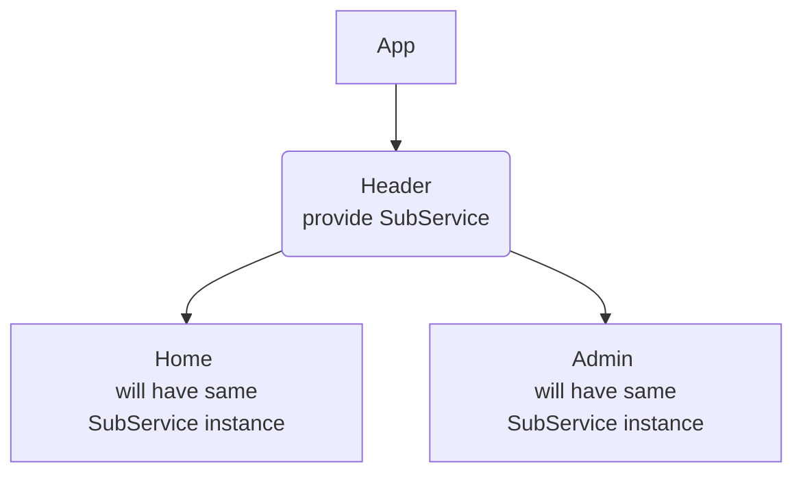
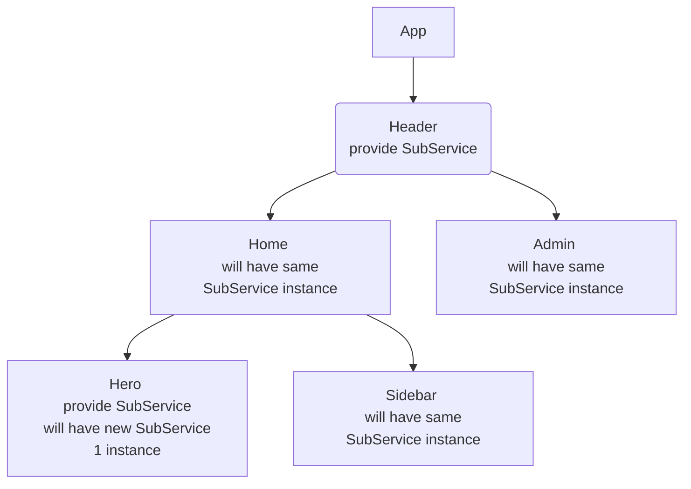
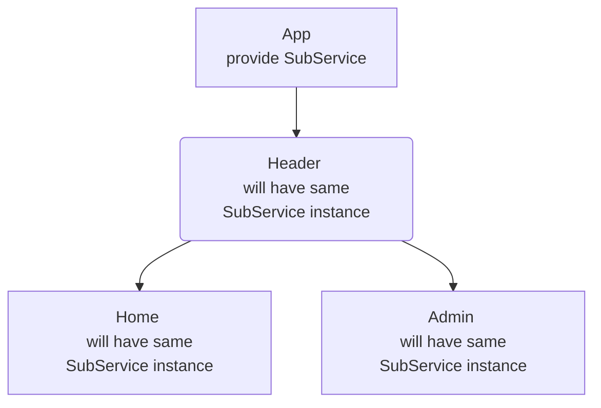

## Angular CLI

```bash 
// Generate component
ng g c product-list 

// Generate directive
ng g d set-background
```

## Types of Component Selectors

* Used as html tag: `<app-nav></app-nav>` 
* Used as html attribute: `<div app-nav></div>`
* Used as css class: `<div class="app-nav"></div>` 

Summary: Mainly used html tag, but will use attribute in case of angular directives

## Data Binding

Data Binding in Angular allows us to communicate between a **component class** and its corresponding **view template** & vice-versa. 


## Component Communication

#### Related Component
* Parent to Child, use *@Input* Decorater 

`parent.component.html`
```html
<app-child [product]="product"></app-child>
```

`child.component.ts`
```typescript
@Input()
product: Product;
```

* Child to Parent, use *@Output* Decorater 

`child.component.ts`
```typescript
@Output()
backToListEvent: EventEmitter<string> = new EventEmitter<string>();

backToList() {
  this.backToListEvent.emit('back');
}
```

`parent.component.html`
```html
<app-child (backToListEvent)="backToListEvent()"></app-child>
```

`parent.component.ts`
```typescript
backToListEvent() {
  this.showCreateProductForm = false;
}
```

#### Non-Related Component


## Template Reference Variable
A template reference variable is a variable which store a reference to a DOM element, Component or Directive on which it is used.
* On DOM element

```html
<input class="product-input" #searchInput>
<button (click)="clickSearch()">Search</button>
```

```typescript
@ViewChild('searchInput')
searchInput: ElementRef;
clickSearch() {
  this.searchText = this.searchInput.nativeElement.value;
}
```

* On Custom Component

```html
<product-list #productListComponent></product-list>
<product-detail *ngIf="productListComponent.selectedProduct"></product-detail>
```

#### ng-template

The ng-template is an Angular element which wraps an html snippet. This html snippet acts and can be used like a template and can be rendered in the DOM.

```html
<ng-template #myTemplate>
  <h3>This is a template</h3>
</ng-template>

<div *ngTemplateOutlet="myTemplate"></div>
<ng-container *ngTemplateOutlet="myTemplate"></ng-container>
```

#### ng-container

The ng-container is a special Angular element that can hold structural directives without adding new elements to the DOM.
*Note: if use div in ngFor, then it will add extra div in DOM*

```html
<ng-container *ngFor="let item of products">
  <p>{{item.name}}</p>
  <p>{{item.price}}</p>
</ng-container>
```  

## Content Projection
Used in Parent - Child component 

#### ng-content

`parent.component.html`
```html
<h2>Parent Component</h2>
<app-child>
  <h3>content to child</h3>
</app-child>
```

`child.component.html`
```html
<h2>Child Component</h2>
<ng-content></ng-content>
```

#### @ContentChild()

`parent.component.html`
```html
<h2>Parent Component</h2>
<app-child>
  <h3>content to child</h3>
  <p #paragraph>This is a paragraph</p>
</app-child>
```

`child.component.ts`
```typescript
export class ChildComponent {
  @ContentChild('paragraph') 
  paraEl: ElementRef;
}
```

## Lifecycle hook

#### Component Initialization (Constructor)


#### ngOnChanges


#### ngOnInit


#### ngDoCheck


#### ngAfterContentInit


#### ngAfterContentChecked


#### ngAfterViewInit


#### ngAfterViewChecked


#### ngOnDestroy


## Custom Attribute Directive

```typescript
import { Directive, ElementRef, OnInit, Renderer2 } from '@angular/core';

@Directive({
  selector: '[appSetBackground]'
})
export class SetBackgroundDirective implements OnInit {
  // private element: ElementRef;

  constructor(private element: ElementRef, private renderer: Renderer2) {
    // this.element = element;
  }

  ngOnInit() {
    this.element.nativeElement.style.backgroundColor = '#36454F';
    this.element.nativeElement.style.color = 'white';
  }
}

```

#### Renderer2

In Angular, we don't recommand to update DOM element via nativeElement, the reason is:
1. Angular keeps the component & view in sync using templates, data binding and change detection etc. All of them are bypassed when we update the DOM directly.
2. The DOM manipulation works only in browsers. You will not be able to use your app in other platforms like web workers, server-side rendering, desktop or mobile apps etc, where there is no browser.
3. The DOM API's does not sanitize the data, Hence it is possible to inject a script, thereby, opening our app an easy target for the XSS injection attacks.

Renderer2 allows us to manipulate the DOM without accessing the DOM elements directly, by providing a layer of abstraction between the DOM element and the component code.

```typescript
import { Directive, ElementRef, OnInit, Renderer2 } from '@angular/core';

@Directive({
  selector: '[appSetBackground]'
})
export class SetBackgroundDirective implements OnInit {

  constructor(private element: ElementRef, private renderer: Renderer2) {}

  ngOnInit() {
    // this.element.nativeElement.style.backgroundColor = '#36454F';
    // this.element.nativeElement.style.color = 'white';
    this.renderer.setStyle(this.element.nativeElement, 'backgroundColor', '#36454F');
    this.renderer.setStyle(this.element.nativeElement, 'color', '#white');
    this.renderer.setAttribute(this.element.nativeElement, 'title', 'html attribute title');
    this.renderer.addClass(this.element.nativeElement, 'css-class-name');
  }
}

```

#### @HostListener

The @HostListener decorator listens to a DOM event on the host element and it reacts to that event by executing an event handler method.
  
```typescript
  import { Directive, ElementRef, HostListener, Renderer2 } from '@angular/core';

  @Directive({
    selector: '[appHighlight]'
  })
  export class HighlightDirective {

    constructor(private element: ElementRef, private renderer: Renderer2) { }

    @HostListener('mouseenter') 
    onMouseEnter() {
      this.renderer.addClass(this.element.nativeElement, 'highlight-price');
    }

    @HostListener('mouseout') 
    onMouseOut() {
      this.renderer.removeClass(this.element.nativeElement, 'highlight-price');
    }
  }

```

#### @HostBinding

The @HostBinding decorator binds a host elements property to a property of a directive or a component class.

```typescript
import { Directive, ElementRef, HostBinding, HostListener, Renderer2 } from '@angular/core';

@Directive({
  selector: '[appHover]'
})
export class AppHoverDirective {

  constructor(private element: ElementRef, private renderer: Renderer2) { }

  @HostBinding('style.backgroundColor') backgroundColor: string = '#28282B';
  @HostBinding('style.border') border: string = 'none';

  @HostListener('mouseenter')
  onMouseEnter() {
    this.backgroundColor = 'white';
    this.border = '1px solid red';
  }

  @HostListener('mouseout')
  onMouseOut() {
    this.backgroundColor = '#28282B';
    this.border = 'none';
  }
}
```

#### Property binding in Directive

Requirement: the background color and text color should be set by user
```typescript
import { Directive, ElementRef, OnInit, Renderer2, Input } from '@angular/core';

@Directive({
  selector: '[appSetBackground]'
})
export class SetBackgroundDirective implements OnInit {
  @Input() backgroundColor: string = '#36454F';
  @Input() textColor: string = 'white'

  // wrap above 2 properties to 1, appSetBackground is alias for this property
  @Input('appSetBackground') changeTextAndBackgroundColor: {backgroundColor: string, textColor: string}

  constructor(private element: ElementRef, private renderer: Renderer2) { }

  ngOnInit() {
    this.renderer.setStyle(this.element.nativeElement, 'backgroundColor', this.backgroundColor);
    this.renderer.setStyle(this.element.nativeElement, 'color', this.textColor);

    this.renderer.setStyle(this.element.nativeElement, 'backgroundColor', this.changeTextAndBackgroundColor.backgroundColor);
    this.renderer.setStyle(this.element.nativeElement, 'color', this.changeTextAndBackgroundColor.textColor);
  }
}

```

```html
<span appSetBackground [backgroundColor]="'red'" [textColor]="'yellow'"></span>

<span [appSetBackground]="{backgroundColor: 'red', textColor: 'yellow'}"></span>
```

#### Conditional Attribute Directive

Requirement: for out of stock product, the directive should add extra css class to host element. For normal product, the directive will do nothing.
```typescript
import { Directive, ElementRef, Renderer2, Input } from '@angular/core';

@Directive({
  selector: '[disableProduct]'
})
export class DisableProductDirective {
  constructor(private element: ElementRef, private renderer: Renderer2) { }

  // use typescript setter on property, we can implement that property like a method
  @Input() 
  set disableProduct(disabled: boolean) {
    if (disabled) {
      this.renderer.addClass(this.element.nativeElement, 'disable-out-of-stock-product');
    }
  }
}
```

```html
<span [disableProduct]="!product.is_in_inventory"></span>
```

#### Create Custom ngClass Directive

ngClass useage like below:
```html
<span [ngClass]="{appHighlight: true, 'app-container': false}"></span>
```

Create own ngClass:
```typescript
import { Directive, ElementRef, Renderer2, Input } from '@angular/core';

@Directive({
  selector: '[appClass]'
})
export class ClassDirective {
  constructor(private element: ElementRef, private renderer: Renderer2) { }

  // set alias to directly use appClass in html
  @Input('appClass') set display(value: Object) {
    let entries = Object.entries(value);
    for (let item of entries) {
      let[className, condition] = item;
      if (condition) {
        this.renderer.addClass(this.element.nativeElement, className);
      }
    }
  }
}
```

```html
<span [appClass]="{appHighlight: true, 'app-container': false}"></span>
```

#### Create Custom ngStyle Directive

ngStyle useage like below:

```html
<span [ngStyle]="{backgroundColor: active ? 'green' : 'red'}"></span>
```

Create own ngStyle:
```typescript
import { Directive, ElementRef, Renderer2, Input } from '@angular/core';

@Directive({
  selector: '[appStyle]'
})
export class StyleDirective {
  constructor(private element: ElementRef, private renderer: Renderer2) { }

  // set alias to directly use appStyle in html
  @Input('appStyle') set style(styles: Object) {
    let entries = Object.entries(styles);
    for (let item of entries) {
      let[styleName, styleValue] = item;
      this.renderer.setStyle(this.element.nativeElement, styleName, styleValue);
    }
  }
}
```

```html
<span [appStyle]="{backgroundColor: active ? 'green' : 'red'}"></span>
```

#### How a Structural Directive Works

*ngIf useage like below:
```html
<div *ngIf="display; else myTemplate">
  <p>this is a p element</p>
</div>

<ng-template #myTemplate>
  <p>it is else block</p>
</ng-template>
```
Structural directive start with *, so when angular parsing this div element, if contain *, then it will convert to below:
```html
<ng-template [ngIf]="display" [ngIfElse]="myTemplate">
  <div>
    <p>this is a p element</p>
  </div>
</ng-template>

<ng-template #myTemplate>
  <p>it is else block</p>
</ng-template>
```

#### Create Custom ngIf Structural Directive
```typescript
import { Directive, TemplateRef, ViewContainerRef, Input } from '@angular/core';

@Directive({
  selector: '[appIf]'
})
export class IfDirective {
  // 1. Get access to the DOM element which we want to Add / Remove
  // 2. Place from where we want to Add or remove DOM element
  constructor(private view: TemplateRef<any>, private template: ViewContainerRef) { }

  @Input() set appIf(condition: boolean) {
    if (condition) {
      this.template.createEmbeddedView(this.view);
    } else {
      this.template.clear();
    }
  }
}
```

```html
<div *appIf="true">
  <p>this is a p element</p>
</div>
```

#### Structural Directive - ngSwitch
```html
<div [ngSwitch]="tab">
  <p *ngSwitchDefault>tab 1</p>
  <p *ngSwitchCase="'tab2'">tab 2</p>
  <p *ngSwitchCase="'tab3'">tab 3</p>
</div>
```

## Services
A service in Angular is a re-usable typescript class that can be used in multiple components across our Angular application.
Using services, we can communicate between non-related components in an easier way.

#### Dependency Injection (DI)

DI is a technique (design pattern) using which a class receives its dependencies from an external source rather than creating them itself.

*Disadvantage of not using Dependency Injection*
1. Without DI, a class is tightly coupled with its dependency. This makes a class non-flexible. Any change in dependency forces us to change the class implementation.
2. It makes testing of class difficult. Because if the dependency changes, the class has to change. And when the class changes, the unit test mock code also has to change.

*Advantage of not using Dependency Injection*
1. DI keeps the code flexible, testable, and mutable.
2. Classed can inherit external logic without knowing how to create it.
3. DI benefits component, directives and pipes.

#### Hierarchical Dependency Injection

When we provide a depdendency on a component, the same instance of that dependency is injected in component class and all its child components and their child components.



* Dependency Override

When we provide a dependency on a component and we also provide a dependency on its child component, child component dependency instance will override its parent component dependency instance.



* Dependency injection on Root Component

When we provide a dependency on root component, same instance of that dependency is injected to all components, directives and services.



```typescript
import SubService from './services/sub.service'
@Component({
  selector: 'app-root',
  templateUrl: './app.component.html',
  providers: [SubService]
})
export class AppComponent {
  constructor(private subService: SubService) {}

  subscribe = this.subService.subscribe();
}
```

* Module Injector

We can also inject a service from Module class. In that case same instance of the dependency will be available throughout the Angular application. In this way we implement singleton pattern where a single instance is shared throughout the application.

```typescript
import SubService from './services/sub.service'
@NgModule({
  declarations: [AppComponent, HeaderComponent],
  imports: [BrowserModule],
  providers: [SubService]
})
export class AppModule {}
```

#### Injecting Service into Another Service
```typescript
import {Injectable} from '@angular/core';
import {LoggerService} from "./logger.service";

@Injectable()
export class UserService {
  constructor(private logger: LoggerService) {}

  createUser() {
    this.logger.logMessage();
  }
}
```

```typescript
import {Injectable} from '@angular/core';

@Injectable() // Optional to add, except depends on other service
export class LoggerService {
  logMessage() {}
}
```

```typescript
import {LoggerService} from './services/logger.service'
import {UserService} from './services/user.service'

@NgModule({
  declarations: [AppComponent, HeaderComponent],
  imports: [BrowserModule],
  providers: [UserService, LoggerService]
})
export class AppModule {}
```

#### Injection Token

`providers: [UserService]` is syntactic sugar for `providers: [{provide: UserService, useClass: UserService}]`

But sometimes, the dependency need to inject is not a instance of class, it maybe a configuration value or string, so we need injection token.

`config.tokens.ts`
```typescript
import { InjectionToken } from '@angular/core';
export const LANG_CONFIG = new InjectionToken<string>('langConfig');
```

`app.module.ts`
```typescript
import { NgModule } from '@angular/core';
import { LANG_CONFIG } from './config.tokens';

@NgModule({
  providers: [
    {
      provide: LANG_CONFIG,
      useValue: 'en-US'
    }
  ]
})
export class AppModule { }
```

`app.module.ts`
```typescript
import { Component, Inject } from '@angular/core';
import { LANG_CONFIG } from './config.tokens';

@Component({
  selector: 'app-root',
  templateUrl: './app.component.html',
})
export class AppComponent {
  constructor(@Inject(LANG_CONFIG) private langConfig: string) {}
}
```

#### Non-Related Component Interaction using Services

`user.service.ts`
```typescript
export class UserService {
  OnUserDetailsClicked: EventEmitter<User> = new EventEmitter<User>();

  OnShowUserDetails(user: User) {
    this.OnUserDetailsClicked.emit(user);
  }
}
```

`user-list.component.ts`
```typescript
export class UserListComponent {
  userService = inject(UserService);

  ShowUserDetails(user: User) {
    this.userService.OnShowUserDetails(user);
  }
}
```

`user-detail.component.ts`
```typescript
export class UserDetailComponent {
  selectedUser: user;
  userService = inject(UserService);

  ngOnInit() {
    this.userService.OnUserDetailsClicked.subscribe((data: User) => {
      this.selectedUser = data;
    })
  }
}
```

## Observable

An Observable is a wrapper around asynchronous data. We use an observable to handle asynchronous data.

RxJS Main Players:


#### Promise vs Observable
1. A promise cannot handle stream of async data. It always returns a single value. On the other hand, we can use observables to handle stream of async data. It can return multiple values.
2. A promise will certainly return a data even if no code is using that data. Whereas an observable will return a data only if someone is going to use that data.
3. A promise is native to JavaScript program. Whereas observable is not native to JavaScript and it is provided by 'RxJS' libraray.


#### Next, Error and Completion of Observable
```typescript
export class AppComponent {
  myObservable = new Observable((observer) => {
    setTimeout(() => {observer.next(1)}, 1000);
    setTimeout(() => {observer.next(2)}, 2000);
    setTimeout(() => {observer.next(3)}, 3000);
    setTimeout(() => {observer.error(new Error('Something went wrong. Please try again later!'))}, 3000);
    setTimeout(() => {observer.complete()}, 3000);
    // after error or complete event called, the following logic will not execute.
    setTimeout(() => {observer.next(4)}, 4000); 
    setTimeout(() => {observer.next(5)}, 5000);
  });

  getAsyncData() {
    this.myObservable.subscribe({
      next: (value) => {
        console.log(value);
      },
      error: (err) => {
        console.log(err.message);
      },
      complete: () => {
        console.log('all the data is streamed!')
      }
    })
  }
}
```

```console
Output: 1, 2, 3, 'Something went wrong. Please try again later!'
```

#### RxJS of() & from() Operator
* The of Operator

The of operator creates an observable from the arguments that we pass into it. You can pass any number of arguments to of operator.
Each argument is emitted separately one after the other. It send the complete signal at the end.

```typescript
export class AppComponent {
  array1 = [1, 3, 5, 7];
  array2 = ['A', 'B', 'C', 'D'];

  myObservable = of(this.array1, this.array2, 'Hello', true);

  getAsyncData() {
    this.myObservable.subscribe({
      next: (value) => {
        console.log(value);
      },
      error: (err) => {
        console.log(err.message);
      },
      complete: () => {
        console.log('all the data is streamed!');
      }
    })
  }
}
```

```console
Output: [1, 3, 5, 7], ['A', 'B', 'C', 'D'], 'Hello', true, 'all the data is streamed!'
```

* The from Operator

The from operator takes a single argument which can be iterated over and convers it into an observable.

```typescript
export class AppComponent {
  array1 = [1, 3, 5, 7];

  myObservable = from(this.array1); // array or string which can be iterated

  getAsyncData() {
    this.myObservable.subscribe({
      next: (value) => {
        console.log(value);
      },
      error: (err) => {
        console.log(err.message);
      },
      complete: () => {
        console.log('all the data is streamed!');
      }
    })
  }
}
```

```console
Output: 1, 3, 5, 7, 'all the data is streamed!'
```

The from operator also can be used to convert a Promise to Observable, like blow:

```typescript
export class AppComponent {
  promiseData = new Promise((resolve, reject) => {
    resolve([10, 20, 30]);
  })

  myObservable = from(this.promiseData);

  getAsyncData() {
    this.myObservable.subscribe({
      next: (value) => {
        console.log(value);
      },
      error: (err) => {
        console.log(err.message);
      },
      complete: () => {
        console.log('all the data is streamed!');
      }
    })
  }
}
```

```console
Output: [10, 20, 30], 'all the data is streamed!'
```

#### The fromEvent Operator
Angular provides FromEvent method to create an observable from DOM events directly.

```html
<button #btn>Button</button>
```

```typescript
export class AppComponent {
  @ViewChild('btn') button: ElementRef;

  ngAfterViewInit() {
    fromEvent(this.button.nativeElement, 'click').subscribe((data) => {
      console.log(data);
    })
  }
}
```

#### RxJS map & filter Operator
The map operator is used to transform data emitted by a source observable in some way.

The filter operator is used to filter data emitted by a source observable based on a given condition.

```typescript
import { from } from 'rxjs';
import { filter, map } from 'rxjs/operators';

export class AppComponent {
  myObservable = from([2, 4, 6, 8, 10, 12]).pipe(
    map((val) => {
      return val * 5; // Result: 10, 20, 30, 40, 50, 60
    }),
    filter((val, i) => {
      return val % 4 === 0; // Result: 20, 40, 60
    })
  )

  getAsyncData() {
    this.myObservable.subscribe({
      next: (value) => {
        console.log(value);
      },
      error: (err) => {
        console.log(err.message);
      },
      complete: () => {
        console.log('all the data is streamed!');
      }
    })
  }
}
```

```console
Output: 20, 40, 60, 'all the data is streamed!'
```

#### Subject in RxJS
A subject is a special type of observable that allows values to be muticasted to many observers. Subject are like EventEmitters, see the section on [`Non-Related Component Interaction using Services`](#non-related-component-interaction-using-services).

`task.service.ts`
```typescript
import { Injectable } from '@angular/core';
import { Subject } from 'rxjs';

@Injectable({
  providedIn: 'root'
})
export class TaskService {
  createTask = new Subject<string>();

  onCreateTask(value: string) {
    this.createTask.next(value);
  }
}
```

`new-task.component.ts`
```typescript
export class NewTaskComponent {
  taskService: TaskService = inject(TaskService);

  createTaskButton(value: string) {
    this.taskService.onCreateTask(value);
  }
}
```

`show-task.component.ts`
```typescript
export class ShowTaskComponent implements OnInit{
  taskService: TaskService = inject(TaskService);

  ngOnInit() {
    this.taskService.createTask.subscribe((newTask: string) => {
      console.log(newTask);
    })
  }
}
```